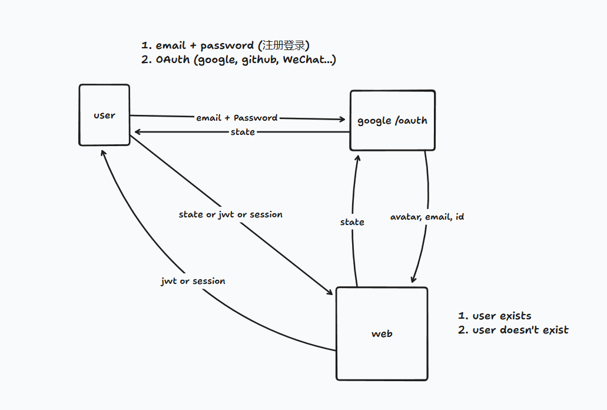

## Project Structure

- storage: 对象存储
- storage/videos: 存储用户上传的视频素材
- storage/images: 存储用户上传的图像素材
- src: 源码目录
- src/main.py: 入口文件
- tests/videos: 存放测试用的视频素材

## Quickstart

```bash
uv run src/main.py
```

## register and login logic
我们采用 OAuth + 邮箱密码登录两种方式



### 数据库设计

`user` 表: 存储用户基础账号信息，支持邮箱密码登录。

字段：

- `id`: 主键
- `user_id`: 对外使用的用户标识
- `email`: 用户邮箱
- `password_hash`: 密码哈希，仅邮箱密码登录时使用
- `created_at`: 创建时间


`user_oauth` 表: 存储第三方 OAuth 绑定信息，一个用户可以绑定多个 OAuth 账号。

字段：

- `id`: 主键
- `user_id`: 外键，关联 `user.user_id`
- `provider`: 第三方平台名称，例如 `google`
- `provider_id`: 第三方平台返回的唯一用户标识

关系：

- `user` 与 `user_oauth` 为一对多关系
- OAuth 登录时先根据 `provider + provider_id` 查找绑定账号，未绑定时再创建或关联 `user`

## Schema 规范

该应用采用 Standard REST Envelope 规范, 具体如下:

成功响应
```json
{
  "success": true,
  "status": 200,
  "message": "OK",
  "meta": {
    "timestamp": "2026-05-28T12:08:00Z",
    "pagination": {
      "current_page": 1,
      "total_pages": 5,
      "limit": 25
    }
  },
  "data": {
    "id": 105,
    "name": "Widget A"
  }
}
```

失败响应结果
```json
{
  "success": false,
  "status": 400,
  "message": "Validation Failed",
  "error": {
    "code": "INVALID_INPUT",
    "details": "The 'email' field is required."
  }
}
```