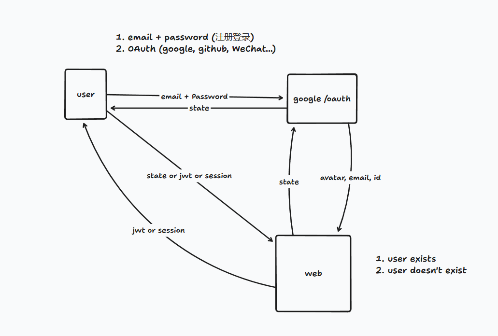

## Project Structure

- backend/
  - docs/: 文档目录
  - notebooks/: jupyter notebook 资源, 项目相关 tutorial
  - storage/: 后端数据存储
    - images/
    - videos/
    - audios/
  - tests/: 测试
  - database.db: 数据库
  - .env: 环境参数
  - app/
    - main.py: 入口文件, 定义 fastapi app, 挂在路由, 全局异常处理器, 数据库初始化等
    - database.py: 数据库 engine 定义以及 get_session 依赖
    - deps.py: 路由依赖, 负责鉴权, 依赖注入: get_current_user, get_video_asset, ...
    - utils.py: 工具文件, 定义一些常用工具函数
    - prompts.py: 定义大模型各个模块提示词
    - llm.py: 提供 openai Client
    - lib/: 第三方库相关模块
      - video.py: 提供视频相关处理函数
      - audio.py: 提供音频相关处理函数
    - models/: 定义数据库 ORM 模型
    - repositories/: 数据库层, 定义数据库相关操作, 例如 create_user 等
    - services/: 服务层, 用于定义业务逻辑
    - routers/: 路由层, 定义路由逻辑
    - tasks/: 任务相关机制, 所有后端处理逻辑都会被封装以及注册为任务由任务管理器统一管理
    - schemas/: 定义请求/响应模型
  

## Quickstart

```bash
uv run src/main.py
```

## register and login logic
我们采用 OAuth + 邮箱密码登录两种方式



### 数据库设计

`user` 表: 存储用户基础账号信息，支持邮箱密码登录。

字段：

- `id`: 主键
- `user_id`: 对外使用的用户标识
- `email`: 用户邮箱
- `password_hash`: 密码哈希，仅邮箱密码登录时使用
- `created_at`: 创建时间


`user_oauth` 表: 存储第三方 OAuth 绑定信息，一个用户可以绑定多个 OAuth 账号。

字段：

- `id`: 主键
- `user_id`: 外键，关联 `user.user_id`
- `provider`: 第三方平台名称，例如 `google`
- `provider_id`: 第三方平台返回的唯一用户标识

关系：

- `user` 与 `user_oauth` 为一对多关系
- OAuth 登录时先根据 `provider + provider_id` 查找绑定账号，未绑定时再创建或关联 `user`

## API 接口

完整的 API 接口文档见 [docs/API.md](./docs/API.md)。

### 新增：`GET /analyze-audio?asset_id=xxx`

传入已上传视频的 `asset_id`，自动分离背景音乐并逐帧流式返回音乐特征（SSE）。

- 首次请求会自动使用 `audio_separator` 分离人声/伴奏，仅保留伴奏（bgm.mp3）
- 分离结果缓存到数据库（`type="audio"`），后续请求直接使用缓存
- 每秒推送约 43 帧，每帧包含局部特征（rms, spectral_centroid 等）和渐进全局特征（BPM, 动态范围, genre, duration）
- 每帧的 `asset_id` 字段即为 BGM 音频的数据库 UUID，可用于后续请求

```bash
curl -N "http://127.0.0.1:8000/analyze-audio?asset_id=xxx" \
  -H "Authorization: Bearer <token>"
```

响应为 `text/event-stream` 格式，每行 `data: {json}` 为一帧数据。

## Schema 规范

该应用参考了 JSend 规范 [JSend 规范](./docs/JSend.md), 并重新设计了一个非常类似的 JSON specification

### 成功响应
```json
{
    "status": "success",
    "data": {
        "token": "xxx",
        "path": "xxx",
        "number": 123,
        ...
    }
}
```

### 失败响应
```json
{
    "status": "fail",
    "message": "xxx"
}
```

### 错误响应 
```json
{
    "status": "error",
    "message": "xxx"
}
```

## Quickstart

初始化环境
```
uv sync
```

启动后端
```
uv run uvicorn app.main:app
```
